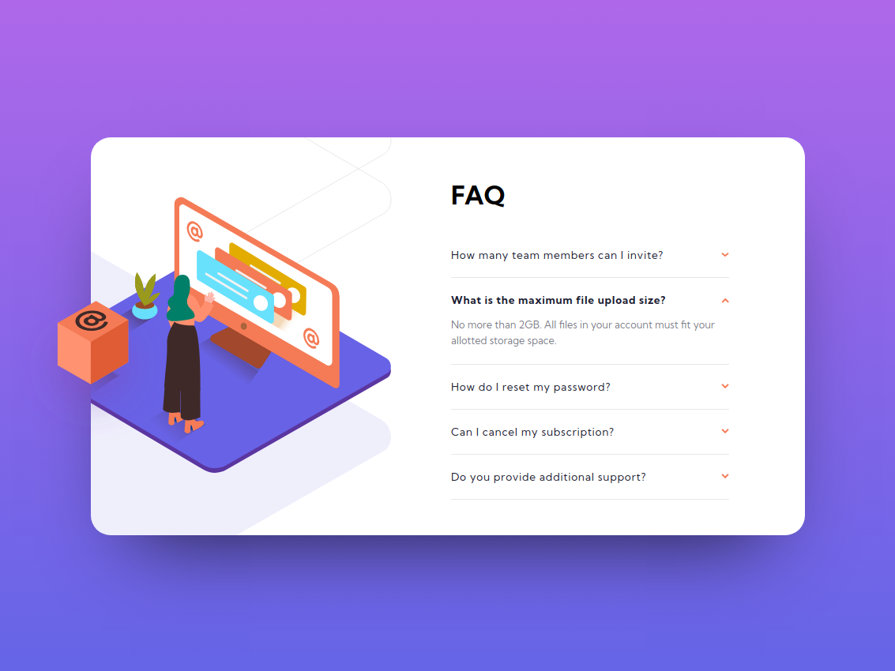

# Frontend Mentor - FAQ accordion card solution (NO JS)

## Table of contents

- [Overview](#overview)
  - [Screenshot](#screenshot)
  - [Links](#links)
- [My process](#my-process)
  - [Built with](#built-with)
  - [What I learned](#what-i-learned)
  - [Continued development](#continued-development)
- [Author](#author)

---

## Overview

### Screenshot

### Links

- Solution URL: https://github.com/JojoRider/FEM-FAQ_accordion_card_NOJS
- Live Site URL: https://jojorider.github.io/FEM-FAQ_accordion_card_NOJS/

---

## My process

This project was a real challenge for me. It included many things I didn't put into practice yet such as free positioning and layering, use of input to interact with others elements on the page.

I didn't use any JS code for this challenge.

It's not perfect and lack some responsivity and other things but I'm pretty happy with the outcome at this point!

1. Analyse of the design schema to identify the different items and how to built the right elements in the HTML file
2. I tried to build the whole HTML file from the beginning by using the BEM methodology in one go and spent some time on it. I did quite well but nonetheless needed to correct or fix little things later on the project
3. Starting of building the style in CSS, from top to bottom
4. Polishing the desktop version
5. Building of the mobile version

### Built with

- Semantic HTML5 markup
- BEM methodology
- CSS custom properties
- Flexbox
- Desktop-first workflow
- NO JS

### What I learned

- Usage of inputs as trigger to interact with other elements
- Sibling combinators to use with the input trick
- Usage of position relative / absolute + z-index + overflow to place and layer elements

---

## Author

- Frontend Mentor - [@JojoRider](https://www.frontendmentor.io/profile/JojoRider)